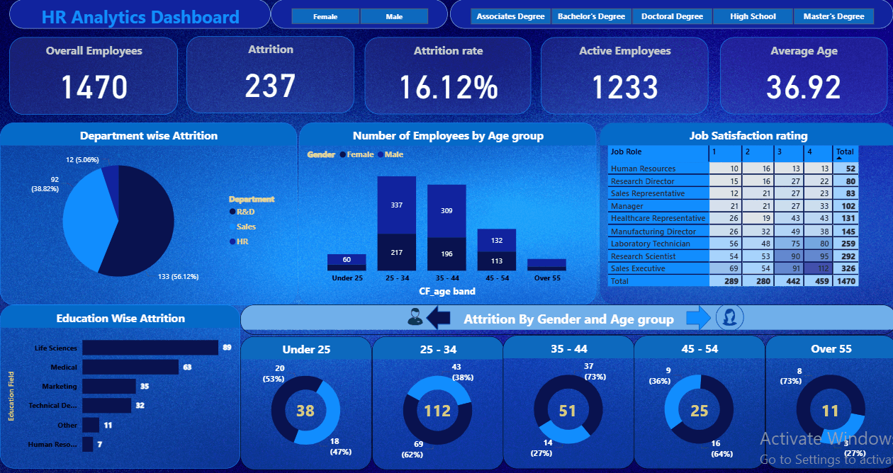
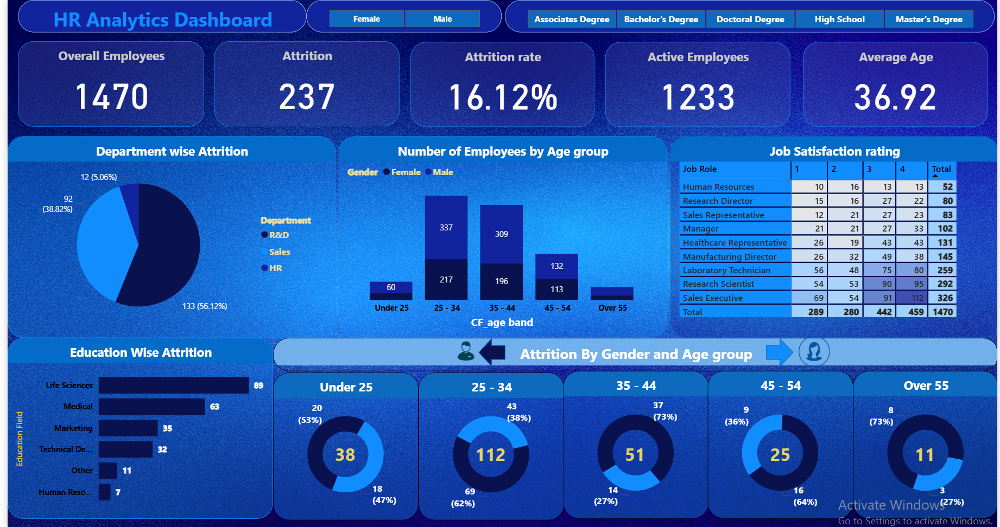
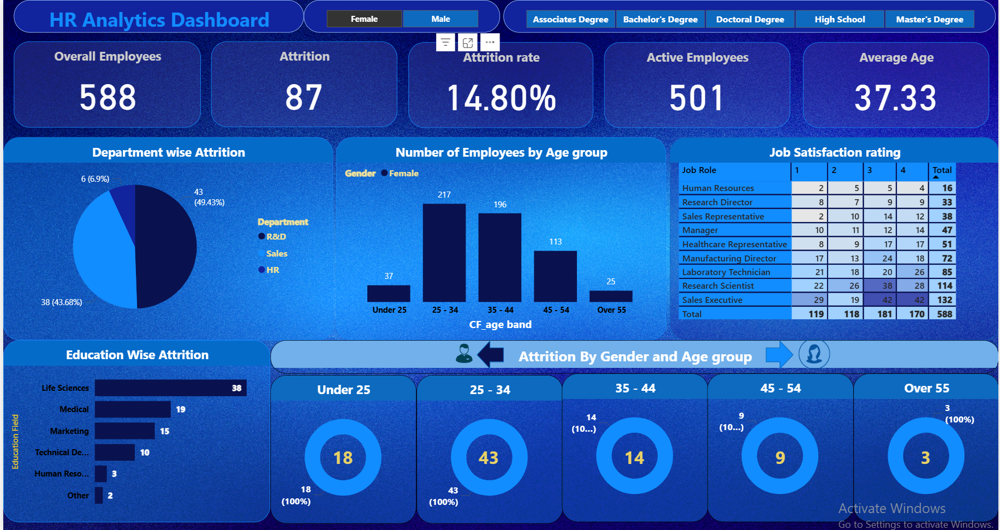
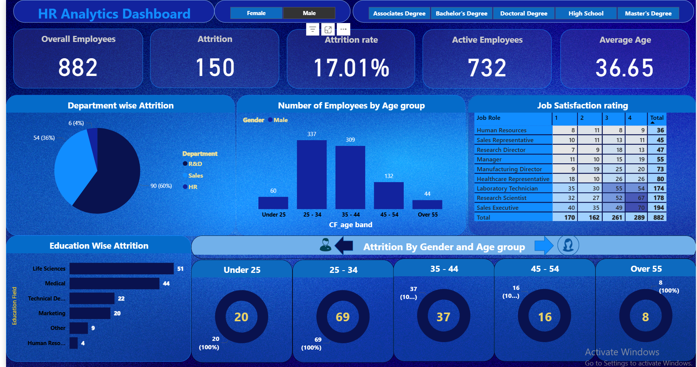

# HR Analytics Project

This project analyzes HR data using Power BI to uncover critical trends around employee attrition, satisfaction, and department-level performance. The insights help HR professionals take proactive steps to reduce attrition, improve satisfaction, and optimize workforce planning.

---

## 📌 Problem Statement

Employee attrition is a major concern for many organizations. High turnover affects team performance, increases recruitment costs, 
and impacts morale. The objective of this HR analytics project is to:

- Analyze attrition trends by age, gender, department, and education
- Identify key factors contributing to employee turnover
- Use interactive dashboards to empower decision-making
- Build an engaging, executive-level HR report

---

## 📊 Dashboard Preview

| Full View |
|-----------|
|  |

📌 *Also includes high-resolution images:*
- 
- 
- 

---

## 📂 Project Structure

HR-Analytics-Project/
│
├── HR Data.xlsx # Cleaned dataset for Power BI
├── Hr_data_Analysis.pbix # Complete Power BI dashboard file
├── Hr1.png / Hr2.png / Hr3.png # Dashboard page images
├── Hr.gif # Animated dashboard preview
└── README.md # Project documentation (this file)

---

## 📈 Key Metrics & KPIs

- **Attrition Rate**
- **Average Monthly Income**
- **Average Age by Department**
- **Attrition by Gender, Education, and Job Role**
- **Job Satisfaction & Work-Life Balance Levels**
- **Environment Satisfaction**

---

## 📘 Insights Discovered

- 🔹 Most attrition occurs in employees aged **25–35**.
- 🔹 **Sales** and **Human Resources** departments showed higher attrition rates.
- 🔹 Employees with **low job satisfaction** and **poor work-life balance** are more likely to leave.
- 🔹 **Males** showed higher attrition than females in key departments.
- 🔹 Attrition decreases as **job level, education, and years at company** increase.

---

## ⚙️ Tools & Technologies Used

- **Power BI** for interactive dashboards and DAX measures
- **Excel** for initial data cleaning and formatting
- **DAX** for calculations (Attrition %, Avg Age, etc.)

---

## 🎯 Business Outcomes

- Helped identify **at-risk segments** of the workforce
- Enabled **data-driven HR decisions**
- Presented actionable insights to reduce attrition and improve employee satisfaction

---

## 🔗 Connect

If you liked this project, feel free to connect with me on:

- 🌐 [My Portfolio]([https://your-portfolio-link](https://niks23c.github.io/Nikhilchavan.github.io/))
- 📘 [LinkedIn](www.linkedin.com/in/nikhil-c-993548151)
- 

---
